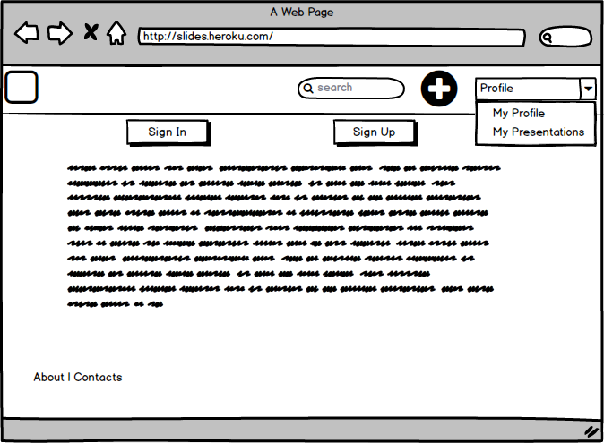
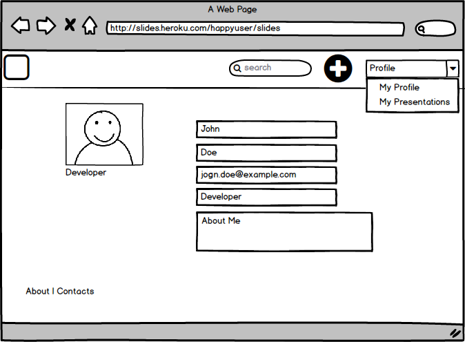
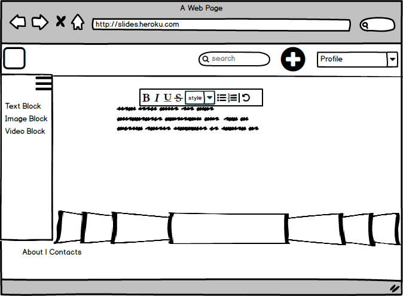
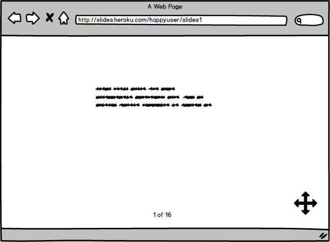
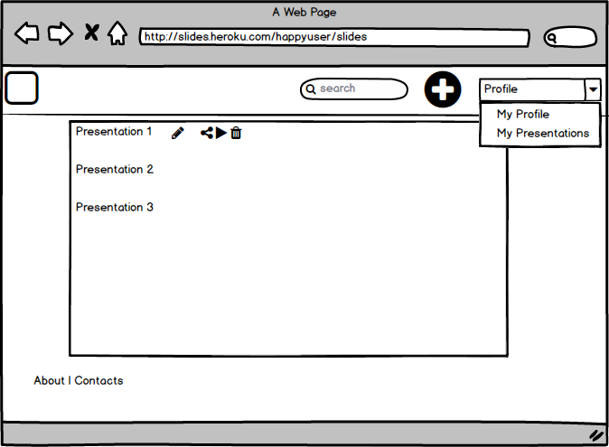

# Requirements Document 
## 1 Introduction
The designed software is web app that represent an lightweight platform for creating and sharing presentations.
## 2 User Requirements

### 2.1 Software Interfaces

Start page:

Profile page:

Workspace:

Slides:

Slides list:

Slides (finished):

#### Used technologies
- HTML, CSS, Typescript and Angular (4+) on the front-end
- Java, Kotlin and Spring Framework on the backend
- MySQL/PostgreSQL RDBMS to store projects
- Redis DB to store temp keys and hashes.

### 2.2 User Interfaces

User interface will provide facilities to create, edit, delete and share presentations. For more details see mockups.

### 2.3 User Characteristics
- Developers, team leads, project managers, HR, resource managers - people in IT sphere, who need to explain their ideas in slides.
- Default staff of institute and school. Engineers, laborants, administration, management, teachers and also students can use it.
- People with a great ideas (e.g., startups) who want to broadcast it.
### 2.4 Assumptions and Dependencies
- Performance issues in old browsers.
- Easy extensibility and changeability of content.
## 3 System Requirements
To use this application, you need a device with Enternet access and latest web browser installed. Recommended browsers:

- Google Chrome
- Mozilla Firefox
- Safari
- Yandex-Browser

### 3.1 Functional Requirements
Each view is represented in mockups.
3.1.1 Possibility to create presentations and slides.

3.1.2 Posiibility to search public presentations.

3.1.3 Possibility to view user's profile information.

3.1.4 User should have out-of-box blocks to create slides.

3.1.5 User should be able to control slides flow (order).

3.1.6 User should have inline edit tools to tune blocks.

3.1.7 Appication should create premanent share links to the presentaion.

3.1.8 Search by tags should be present.

3.1.9 Tags autocompletion.

### 3.2 Non-Functional Requirements
#### 3.2.1 SOFTWARE QUALITY ATTRIBUTES
* Performance - this platform is intended to be lightweight and easy to use, so it should be fast to provide it. App loading can take a several time (about 2 seconds), but all subsequent actions should not take more than 100ms.

* Reliability - this web app must be deployed 24 hours per day, so user should be able to access it whenever he wants. Measures of time when user can't access web page must be more than 24 hours per month.

* Responsive Design - content must be readable on mobile, tablet and desktop devices.

* Throughput - Simultaneously 1000 users at the same time (It's mostly heroku issue, but it also depends on application). 

#### 3.2.2 EXTERNAL INTERFACES

* Minimal supported screen resolution 320x568 for mobile phones.

#### 3.2.3 CONSTRAINTS
* Backend: Java 8, Spring Framework ^4.0.0
* Frontend:Twitter Bootstrap ^3.0.0, Angular 2 (4+).
* Database: MySQL ^5.1 / PostgreSQL ^9.5
* Cache: Redis ^4.0.2
